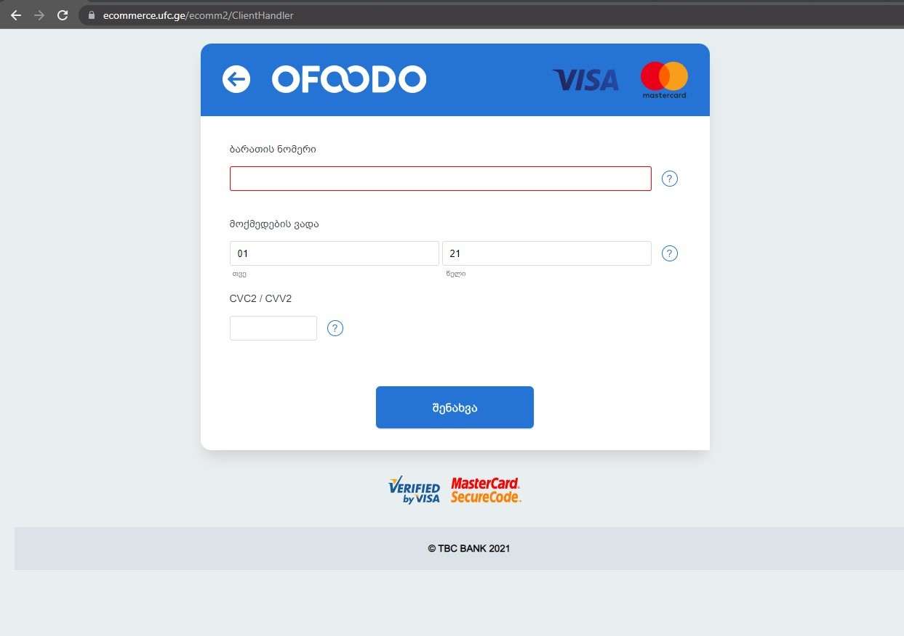

# Payment

## Getting cards from the backend

For getting user cards we call

```
payment/api/v1.0/saleportal/users/getcards
```

with headers:

```
teamreferer: ofoodo;
authorization: Bearer {token}
```

Response is a list of

```ts
cardId: "cecf8d55-742d-4165-9440-048bf6fc5a7f";
cardNumber: "4***********5513";
expiratrionMonth: "10";
expiratrionYear: "22";
paymentSystem: "tbcbank";
```

## Adding a card

First we call

```
/payment/api/v1.0/saleportal/users/processCardSave/tbcbank
```

with specific headers:

```ts
teamreferer: ofoodo;
failurl: http://localhost:4200/pr/profile/payment
successurl: http://localhost:4200/pr/profile/payment
```

if payment system exists we using **_url_** from response model to go to bank page



if succes we redirect back to **_http://{host}/pr/profile/payment_**

if failed, for now backend returns call with status code 400 and error message

```
https://apis.bonee.net/payment/api/v1.0/partners/order/payment/tbcbank/fail
```
